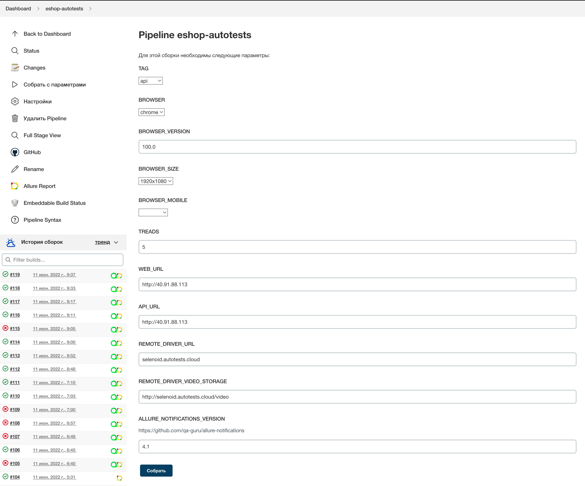
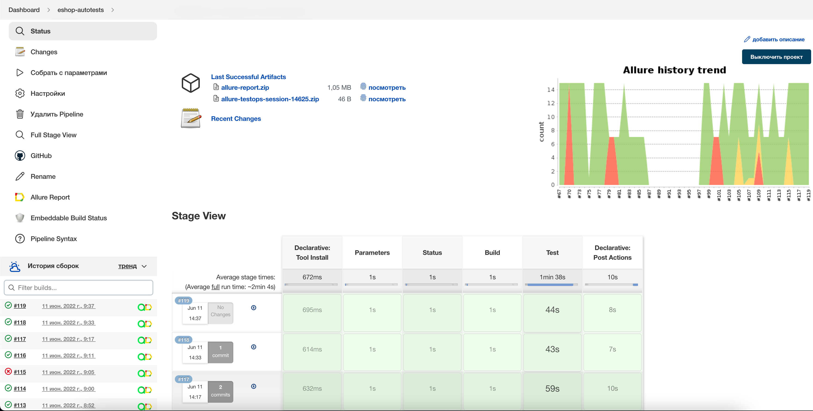
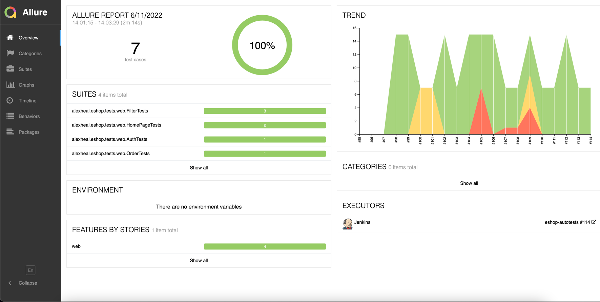
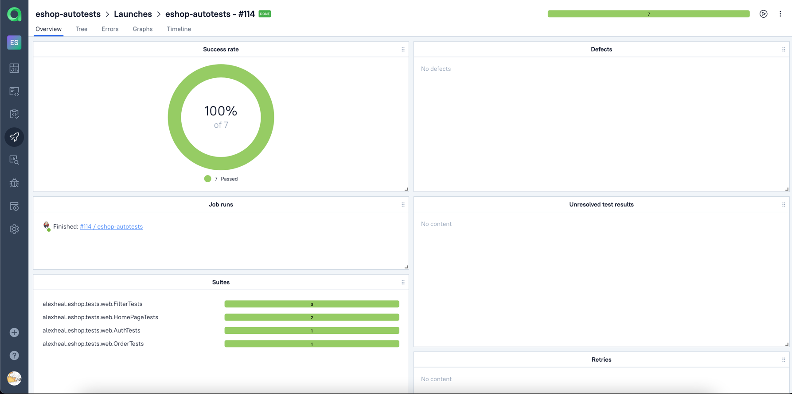
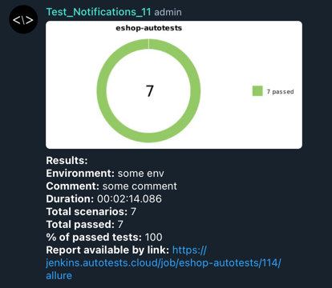

# Autotest for Microsoft eshop projects
### Web UI & API - <a target="_blank" href="https://github.com/dotnet-architecture/eShopOnContainers">eShopOnContainers</a>

> The app deployed with kubernetes on MS Azure, good demonstration about enterprise microservice architecture

### Mobile - <a target="_blank" href="https://github.com/dotnet-architecture/eshop-mobile-client">eshop mobile client</a>

> Cross-platform mobile eshop client that supports Android, iOS, UWP. Current autotests used build from this pull request <a target="_blank" href="https://github.com/dotnet-architecture/eshop-mobile-client/pull/23">pull request</a>

// readme in progress

##  Technology stack

<h2>:arrows_counterclockwise: Shared part</h2>

<h3> 
 Jenkins <a target="_blank" href="https://jenkins.autotests.cloud/job/eshop-autotests/">pipeline.</a> For access to jenkins contact with me.
</h3>

### build with param screen
*For launch remote tests it's necessary to click the option <code><strong>*Собрать с параметрами*</strong></code>, then to fill build settings and to click the button <code><strong>*Собрать*</strong></code>.*

After tests execution, in the panel <code><strong>*История сборок*</strong></code> in the row with build number
icons <code><strong>*Allure Report*</strong></code>
and <code><strong>*Allure TestOps*</strong></code> will appear.

*Icon <code><strong>*Allure Report*</strong></code> opens
html-report in Allure Report.*

*Icon <code><strong>*Allure TestOps*</strong></code> opens
html-report in Allure TestOps.*

<h2>:globe_with_meridians: Web UI part</h2>

<h3> :white_check_mark: Covered functionality</h3>
    <ul>
        <li>[X] Auth Tests </li>
        <li>[X] Filter Tests </li>
        <li>[X] HomePage Tests </li>
    </ul>

##  Tests results report in [Allure Report](https://alexheal.github.io/eshop-artefacts/)

### :pushpin: Common information

*Allure report main page contains next information blocks:*
> - [x] <code><strong>*ALLURE REPORT*</strong></code> -  date and time of tests launch, total number of executed cases and the diagram with indication of percentage and number of successful, failed and broken tests
>- [x] <code><strong>*TREND*</strong></code> - displays trend of passing tests from one build to another
>- [x] <code><strong>*SUITES*</strong></code> - displays the distribution of tests results by tests suites
>- [x] <code><strong>*ENVIRONMENT*</strong></code> - displays test environment where tests were launched
>- [x] <code><strong>*CATEGORIES*</strong></code> - displays the distribution of failed tests by types of defects
>- [x] <code><strong>*FEATURES BY STORIES*</strong></code> - displays the distribution of tests by functionality, which they check
>- [x] <code><strong>*EXECUTORS*</strong></code> - displays the executor of the current build (link to Jenkins build)

  

##  [Allure TestOps](https://allure.autotests.cloud/launch/13303) integration

### :pushpin: Overview dashboard

  

##  Telegram notifications using a bot

> After the pipeline is completed, created <code>Telegram</code>-bot automatically handles and sends a message with a test run report.

##  Example of test execution in Selenoid

> A video is attached to each test in the allure report.

https://user-images.githubusercontent.com/24870446/174431817-6defe430-2753-4078-b9a2-e51bf9b8d2e9.mp4

